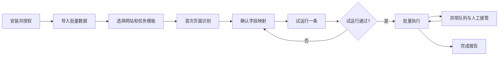
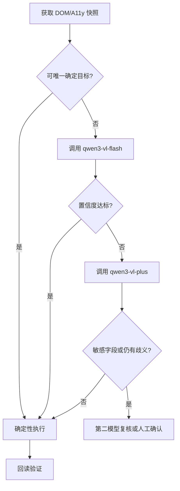

# SmartFill 产品需求文档

| 项目 | 内容 |
|---|---|
| 文档版本 | v0.1 |
| 产品阶段 | MVP / 第一版 |
| 目标用户 | 需要跨网页批量填写资料的运营、客服、数据录入人员及企业管理员 |
| 核心目标 | 在不配置坐标和页面专用 XPath 的前提下，理解页面字段语义并可靠完成批量填写 |

## 1. 背景与问题

传统 RPA 依赖固定坐标、CSS Selector 或 XPath。页面布局、分辨率、弹窗和组件结构变化后，流程容易失效。SmartFill 需要将“页面理解”和“动作执行”分离：

- 页面理解层识别页面类型、字段含义、弹窗和候选操作。
- 决策层把统一人物字段映射到页面字段，并给出证据与置信度。
- 执行层只执行允许的结构化动作，并在每一步后验证结果。
- 异常层处理中断、重试、人工接管和断点恢复。

## 2. 产品目标与非目标

### 2.1 第一版目标

1. 支持账号登录、进入资料页、填写人物资料、暂停确认和提交。
2. 支持 Excel/CSV 批量数据导入、格式校验和脱敏预览。
3. 支持用户名、密码、姓名、性别、证件类型、身份证号、手机号、邮箱和地址等常用字段。
4. 支持 DOM/无障碍树语义识别以及视觉模型兜底。
5. 支持广告、Cookie、通知、活动弹窗和登录失效等常见中断。
6. 支持逐字段检查点、回读验证、失败重试、跳过和人工接管。
7. 支持按网站保存经过确认的字段映射模板。
8. 支持执行记录、脱敏截图、异常原因和批次报告。

### 2.2 第一版非目标

- 不提供验证码破解、反爬绕过或规避网站安全机制。
- 不自动处理支付、合同确认、授权同意等高风险操作。
- 不承诺任意网站零配置、百分之百成功。
- 不控制用户日常桌面的真实系统鼠标；默认在独立浏览器环境执行。
- 不在第一版实现移动 App 和远程桌面自动化。

## 3. 用户角色

### 3.1 企业管理员

- 配置允许访问的域名和浏览器环境。
- 配置视觉模型、密钥、数据保留和脱敏策略。
- 配置自动提交、人工确认、重试和并发策略。
- 查看全局审计日志和批次统计。

### 3.2 业务操作员

- 导入数据并创建批量任务。
- 完成首次字段映射确认和试运行。
- 查看实时执行情况，处理验证码与异常。
- 导出执行结果。

### 3.3 审核员

- 复核低置信度字段和敏感字段。
- 批准或拒绝提交。
- 查看操作证据和变更前后数据。

## 4. 核心用户流程



## 5. 功能需求

### 5.1 数据导入与标准化

| 编号 | 需求 | 优先级 | 验收标准 |
|---|---|---:|---|
| DATA-01 | 支持 CSV、XLSX 文件导入 | P0 | 可预览表头、前 20 行和总记录数 |
| DATA-02 | 将源列映射为统一人物字段 | P0 | 支持自动建议和人工修改 |
| DATA-03 | 格式校验 | P0 | 能识别空值、重复、身份证/手机号/邮箱格式问题 |
| DATA-04 | 敏感数据脱敏 | P0 | UI、普通日志和截图中默认不可见完整值 |
| DATA-05 | 数据源插件 | P1 | 后续可接数据库和业务 API，不改变任务执行接口 |

统一字段命名示例：

```json
{
  "account.username": "zhangsan",
  "account.passwordRef": "vault://batch-001/user-001",
  "person.fullName": "张三",
  "person.gender": "male",
  "person.idType": "CN_ID_CARD",
  "person.idNumber": "110***********1234",
  "person.phone": "138********",
  "person.email": "zhangsan@example.com"
}
```

### 5.2 页面感知与字段映射

| 编号 | 需求 | 优先级 | 验收标准 |
|---|---|---:|---|
| VISION-01 | 抽取 DOM、ARIA、label、role、placeholder 和 autocomplete | P0 | 对标准 HTML 表单无需视觉模型即可识别 |
| VISION-02 | 生成交互元素快照 | P0 | 每个元素有临时 ID、语义、类型、可见性、区域和 frame 路径 |
| VISION-03 | 视觉模型识别 | P0 | 可从截图识别字段标签、按钮、弹窗和矩形区域 |
| VISION-04 | 字段映射证据 | P0 | 每个映射返回字段、目标、证据和置信度 |
| VISION-05 | 多模型复核 | P1 | 中等置信度时可调用第二模型，意见不一致进入人工队列 |
| VISION-06 | 模板复用和失效检测 | P0 | 页面结构未明显变化时复用；失效时自动重新识别 |

默认识别优先级：

1. HTML label、accessible name、role。
2. autocomplete、name、placeholder、input type。
3. 附近文字、容器标题和元素几何关系。
4. 局部截图 OCR/视觉理解。
5. 全屏 GUI 模型坐标定位。

### 5.3 浏览器执行

允许动作白名单：

- `navigate(url)`
- `click(elementId)`
- `fill(elementId, valueRef)`
- `select(elementId, option)`
- `check(elementId, checked)`
- `scroll(container, direction)`
- `wait(condition, timeout)`
- `request_human(reason)`
- `finish(result)`

执行要求：

- 动作执行前校验元素仍然可见、可交互且位于允许域名。
- 填写值由安全执行器根据 `valueRef` 获取，不由模型输出真实值。
- 每个字段填写后回读页面值并运行字段校验器。
- 提交前重新校验页面、字段完整性和提交策略。
- 同一提交动作必须具备幂等保护，避免刷新后重复提交。

### 5.4 异常与中断处理

| 类型 | 默认策略 |
|---|---|
| Cookie/隐私弹窗 | 选择“仅必要”或按管理员策略处理 |
| 广告、订阅、活动弹窗 | 关闭后重新获取页面状态 |
| 浏览器通知权限 | 默认拒绝 |
| 登录失效 | 自动重登一次，仍失败则暂停 |
| 验证码/MFA | 暂停并请求人工处理 |
| 密码错误 | 不重复尝试，当前记录失败 |
| 限流/服务繁忙 | 指数退避，超过上限暂停批次 |
| 意外跨域跳转 | 立即停止并告警 |
| 字段歧义 | 进入异常队列，不猜测填写 |
| 业务校验错误 | 保存页面提示并跳过或人工处理 |

所有处理器统一返回 `RESOLVED`、`RETRY`、`SKIP_RECORD`、`NEED_HUMAN` 或 `FATAL`。

### 5.5 任务管理与状态

任务状态：`DRAFT → VALIDATING → READY → RUNNING → PAUSED → COMPLETED/FAILED/CANCELLED`。

单条记录状态：`PENDING → LOGIN → NAVIGATING → MAPPING → FILLING → VERIFYING → REVIEW → SUBMITTING → SUCCEEDED/FAILED/SKIPPED`。

每条记录维护字段级检查点：已填写字段、待填写字段、当前 URL、页面指纹、是否提交、最后动作和恢复次数。

### 5.6 操作台、异常队列和报告

- 实时展示当前记录、当前步骤、浏览器画面和最近动作。
- 支持暂停、继续、跳过、终止和人工接管。
- 异常队列展示候选字段、模型证据、置信度和页面截图。
- 完成报告包含成功、失败、跳过、待确认及错误分类。
- 支持 CSV/XLSX 导出和按批次查询审计记录。

## 6. 模型路由策略



模型输出必须通过 JSON Schema 校验，不允许模型直接调用系统鼠标或访问密钥。

## 7. 安全与隐私要求

1. 密码、身份证号等敏感数据加密存储，密钥和数据分离。
2. 模型仅接收字段标识、页面结构摘要和经过脱敏/裁剪的截图。
3. 登录凭据只能发送到管理员批准的精确 origin。
4. 浏览器运行在独立用户目录、容器或虚拟机中。
5. 默认禁止下载、上传本地文件、打开外部应用和访问未授权域名。
6. 页面文本一律视为不可信内容，不得覆盖系统任务和安全策略。
7. 高风险动作必须人工确认，并记录确认人、时间和操作证据。
8. 审计日志不可记录明文密码、完整身份证号和 Cookie。

## 8. 非功能需求

- 可靠性：任一步骤失败都能定位到记录、页面状态和动作；不得静默失败。
- 可恢复性：进程重启后可从记录级或字段级检查点恢复。
- 可观测性：记录任务耗时、模型耗时、Token、重试、人工介入和错误类型。
- 可扩展性：浏览器、视觉模型、数据源、字段 Schema 和异常处理器均为插件接口。
- 兼容性：第一版支持最新版 Chrome/Edge Chromium 内核和 1280×720 以上视口。
- 性能：不以固定频率全屏截图；仅在导航、状态变化、失败和验证时按需截图。

## 9. 第一版上线门槛

- 在至少 3 个结构差异明显、已授权的测试网站完成端到端试运行。
- 普通字段映射、敏感字段映射、弹窗处理分别建立回归测试集。
- 所有提交动作都可追踪且不存在重复提交。
- 密码和身份证明文不会出现在模型请求、普通日志和截图中。
- 低置信度、验证码和跨域跳转能够可靠暂停。
- 操作员可在 3 分钟内完成数据导入、试运行和批量启动。

## 10. 后续版本

- V1.1：数据库/API 数据源、第二视觉模型、字段模板市场。
- V1.2：多浏览器 Worker、审批工作流、企业 SSO、私有化模型。
- V2：移动端/远程桌面、流程编排器、基于历史轨迹的自动评测与优化。

