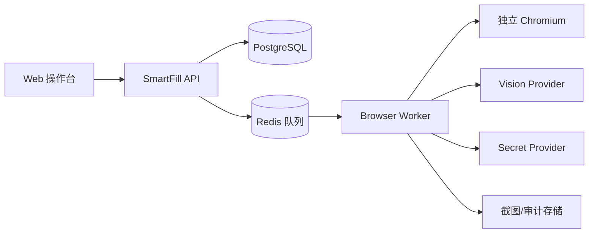

# SmartFill 第一版对接与操作文档

本文同时面向实施人员和业务操作员。当前仓库已经包含可运行的截图优先视觉代理
纵向链路；DOM/无障碍信息仅用于给当前截图中的交互目标生成短期落地 ID，不负责页面语义判断。
本文件定义完整第一版的接口、配置和标准操作流程。实际完成度见
[系统架构与实现进度](06-system-architecture-and-progress.md)。

## 1. 第一版组成



建议第一版技术栈：

- Web：React + TypeScript + Vite。
- API：Python 3.12 + FastAPI + Pydantic。
- 队列：Celery/RQ + Redis。
- 数据库：MySQL 8 + SQLAlchemy 2 + Alembic。
- 浏览器：Chromium + CDP；执行器适配 Stagehand 或 Playwright。
- 默认视觉 API：阿里云百炼 `qwen3-vl-flash`、`qwen3-vl-plus`。
- 文件与截图：开发环境本地目录，生产环境 MinIO/OSS。

## 2. 阿里云百炼接入

### 2.1 准备工作

1. 在阿里云百炼控制台开通模型服务。
2. 创建工作空间和 API Key。
3. 确认所在地域可使用 `qwen3-vl-flash` 和 `qwen3-vl-plus`。
4. 将密钥写入密钥服务或环境变量，不要写入数据库和代码仓库。

建议配置项：

```dotenv
SMARTFILL_DASHSCOPE_API_KEY=<由部署环境注入>
SMARTFILL_DASHSCOPE_FAST_MODEL=qwen3-vl-flash
SMARTFILL_DASHSCOPE_STRONG_MODEL=qwen3-vl-plus
SMARTFILL_DASHSCOPE_BASE_URL=https://dashscope.aliyuncs.com/compatible-mode/v1
```

具体 Base URL 需按阿里云账号和地域配置。生产环境应使用模型快照或经过回归验证的模型版本，避免主线模型更新造成行为漂移。

### 2.2 统一 VisionProvider 接口

```python
class VisionProvider(Protocol):
    async def analyze(self, request: VisionRequest) -> VisionDecision: ...


class VisionRequest(BaseModel):
    task: str
    screenshot: str
    dom_summary: list[InteractiveElement]
    allowed_actions: list[str]
    canonical_fields: list[str]
    previous_action: Action | None


class VisionDecision(BaseModel):
    page_state: str
    interruptions: list[Interruption]
    field_mappings: list[FieldMapping]
    next_action: Action | None
    confidence: float
    need_human: bool
```

应用必须校验模型输出。校验失败时仅允许重试或进入人工队列，不能从自然语言中猜测动作。

### 2.3 模型提示词约束

模型输入包含：

- 当前业务目标。
- 脱敏截图或局部截图。
- DOM/无障碍树交互元素摘要。
- 允许动作列表。
- 统一字段列表和别名。
- 最近一次动作及其验证结果。

模型不得获得：

- 明文密码、完整身份证号、Cookie、Token。
- 未授权域名的页面信息。
- 本地文件系统和通用命令执行权限。

建议响应格式：

```json
{
  "pageState": "profile_form",
  "interruptions": [],
  "fieldMappings": [
    {
      "canonicalField": "person.idNumber",
      "elementId": "e-42",
      "bbox": [412, 336, 786, 382],
      "confidence": 0.96,
      "evidence": ["标签为证件号码", "证件类型为身份证"]
    }
  ],
  "nextAction": {
    "type": "fill",
    "elementId": "e-42",
    "valueRef": "person.idNumber"
  },
  "confidence": 0.96,
  "needHuman": false
}
```

### 2.4 默认执行路由

- 所有目标驱动任务均调用视觉模型理解页面，不再提供页面字段扫描或 DOM 字段别名配置。
- 操作员明确选择 `none`、`login`、`register` 或 `manual`，模型不得自行改变账户流程。
- 首次立即截图，后续默认每 5 秒重新观察；菜单点击、页面跳转和字段填写后均使用新截图决策。
- 模型只引用当前观察中的短期元素 ID；执行器校验白名单、动作类型和置信度后才落地。
- 截图中同时出现地区“确认”和“重新选择”时，执行器默认确认当前地区，避免在错误地区目录中继续规划。
- 无客户字段的入口查找任务在点击语义匹配入口后遇到登录墙即完成；登录墙是入口已找到的结果，
  不再进入登录、注册或资料缺失流程。
- 登录/注册页或目标业务表单缺少客户资料时返回字段清单并暂停，补齐后复用同一浏览器会话继续。
- 敏感字段或动作仍有歧义、出现验证码/MFA、跨域或策略拒绝时进入人工门禁。

## 3. 浏览器执行器对接

### 3.1 浏览器环境

- 每个并行任务使用独立 Browser Context。
- 同一账号的登录和资料填写在同一 Context 内完成。
- 浏览器使用固定语言、时区、视口和缩放比例。
- 浏览器只允许访问任务域名白名单。
- 默认不复用业务人员日常 Chrome Profile。

### 3.2 页面快照

页面快照至少包含：

```json
{
  "url": "https://example.com/profile",
  "title": "个人资料",
  "viewport": {"width": 1440, "height": 900, "scale": 1},
  "elements": [
    {
      "id": "e-42",
      "role": "textbox",
      "accessibleName": "证件号码",
      "label": "证件号码",
      "placeholder": "请输入身份证号",
      "inputType": "text",
      "visible": true,
      "enabled": true,
      "bbox": [412, 336, 786, 382]
    }
  ]
}
```

元素 ID 只在当前页面快照中有效。页面变化后必须重新获取元素，禁止沿用旧坐标。

### 3.3 安全填值

模型返回 `valueRef` 后，执行器按以下顺序处理：

1. 校验当前 origin 在白名单内。
2. 校验 `elementId` 仍对应预期字段。
3. 从任务数据或 SecretProvider 读取真实值。
4. 填写目标元素并触发页面需要的 input/change/blur 行为。
5. 回读值并运行格式校验。
6. 记录脱敏结果。

## 4. 数据文件规范

### 4.1 动态字段 Schema

Browser Job 可以随任务提交 `field_definitions`，不再局限于系统内置人物字段：

```json
{
  "fields": {
    "person.firstName": "San",
    "account.password": "secret-value"
  },
  "field_definitions": [
    {
      "key": "person.firstName",
      "display_name": "名",
      "aliases": ["First Name", "Given Name", "名"],
      "input_kind": "text",
      "sensitive": false,
      "source_field": null,
      "autocomplete_hints": ["given-name"]
    },
    {
      "key": "account.passwordConfirmation",
      "display_name": "确认密码",
      "aliases": ["Confirm", "Confirm Password"],
      "input_kind": "password",
      "sensitive": true,
      "source_field": "account.password",
      "autocomplete_hints": ["new-password"]
    }
  ]
}
```

字段标识和语义词均经过长度、格式、控制字符和数量校验。定义必须覆盖提交值；派生字段必须
引用当前 Schema 中的字段，禁止循环引用；从敏感字段派生的字段也必须标记为敏感。
Schema 只描述语义，不接受 CSS、XPath 或 JavaScript。

第一版推荐模板列：

| 列名 | 必填 | 说明 |
|---|---:|---|
| record_id | 是 | 批次内唯一记录编号 |
| login_username | 是 | 登录用户名 |
| password_ref | 是 | 密钥引用，不建议直接放密码 |
| full_name | 否 | 姓名 |
| gender | 否 | `male`、`female`、`unknown` 或配置枚举 |
| id_type | 否 | 如 `CN_ID_CARD` |
| id_number | 否 | 身份证号；导入后加密存储 |
| phone | 否 | 手机号 |
| email | 否 | 邮箱 |
| address | 否 | 地址 |

导入阶段必须完成列映射、格式校验、重复检测和敏感字段确认。

## 5. 业务操作流程

### 5.0 运行时白名单

进入 Web 左侧“系统设置”，在“目标网页白名单”中每行配置一个 Origin，例如
`https://example.com`。保存后写入 MySQL `system_settings` 并立即生效；页面扫描、步骤导航、
iframe/资源路由和跳转后的 Origin 校验都会读取最新配置，无需修改 `.env` 或重启服务。

非回环地址只允许 HTTPS。本机联调可以使用 `http://127.0.0.1:端口` 或
`http://localhost:端口`。

### 5.1 创建任务

1. 登录 SmartFill 操作台。
2. 点击“新建填写任务”。
3. 选择已有网站模板，或输入经过管理员批准的目标网站。
4. 上传 CSV/XLSX，并确认列映射。
5. 选择“仅填写”“确认后提交”或“自动提交”；提交目标由视觉模型在运行时识别。
6. 配置并发数、失败后是否继续和弹窗策略。

### 5.2 首次识别与试运行

当配置的 URL 是官网首页而不是表单页时：

1. 默认入口模式为 `auto`。Worker 截取当前可视页面，由多模态模型判断目标表单是否已经出现或是否需要先进入登录/注册流程。
2. 模型结合业务目标和字段意图规划入口动作；DOM/ARIA 只生成当次观察的短期动作目标 ID，不参与语义打分或页面字段发现。
3. 唯一高置信候选可直接点击；意图不明确、目标无法落地或存在挑战时进入人工处理。
4. 跳转后必须重新截图和重新决策，不能沿用首页的元素 ID、坐标或模型结论。
5. 跨 Origin 登录页必须预先加入白名单；未批准跳转会被网络路由层阻止。

页面字段扫描 API、页面别名配置和人工 DOM 字段候选映射已经废弃。用户只定义要填写的业务数据；
页面控件的识别、区分和重新观察全部属于视觉执行环，不会作为可复用配置暴露给用户。

1. 启动一个独立浏览器窗口。
2. SmartFill 通过截图识别登录页和字段。
3. 操作员只确认高风险动作，不维护登录按钮或字段映射。
4. 登录后重新截图识别资料页。
5. 操作员处理验证码、MFA、遮挡或视觉低置信度状态。
6. 选择一条数据进行试运行。
7. 系统填写但不提交，逐字段显示验证结果。
8. 操作员确认后保存模板并启动批次。

### 5.2.1 登录后填写资料的顺序工作流

1. 配置第一个“登录”步骤：登录页或官网入口 URL、账号密码字段、入口策略和登录提交策略。
2. 点击“保存当前步骤并添加下一步”。
3. 配置第二个“完善资料”步骤：资料页 URL、动态字段 Schema 和资料提交策略。
4. 启动任务后，Worker 在同一个隔离 Browser Context 中依次执行，步骤间保留 Cookie、
   Session Storage 和登录态。

### 5.2.2 手机、邮箱验证与人工登录复用

1. 账户流程选择 `manual`，配置稳定的会话标识、同源且不含查询参数或片段的心跳 URL，以及 30～3600 秒心跳间隔。
2. 首次执行停在 `manual_login` 人工门禁；操作员在真实浏览器完成短信、邮箱、扫码或 SSO。
3. 操作员确认完成后继续视觉任务；完成的 Browser Context 转入内存会话池。
4. 空闲期间 Worker 在同一 Context 的独立页加载心跳 URL，使站点的 Cookie、Local Storage 和
   前端刷新逻辑正常运行；仅未跳离配置地址的 2xx 结果视为健康。
5. 后续任务使用相同会话标识时先做一次心跳，再转移同一个 Context；失败则销毁旧会话并重新要求人工登录。

心跳 URL 必须由业务方确认是安全只读页面、与目标 URL 同源且不含查询参数或片段。会话内容不写入数据库；服务或
客户端重启后需要重新人工登录。跨重启恢复应由桌面客户端使用系统密钥库加密 Browser Profile。
5. 任一步骤出现字段歧义、验证码/MFA 或提交歧义时，整个工作流暂停并保留原会话；人工确认后
   从当前步骤继续。
6. 任务列表展示当前步骤、总步骤数、字段进度和状态；任务详情展示脱敏配置快照及 MySQL 中的
   追加式执行时间线。
7. 点击任务行的“复用”直接进入执行控制台并回填全部步骤；步骤可逐项切换编辑。快照只回填
   非敏感字段值，密码、证件号、手机号等字段必须重新输入。

第一版工作流支持 1～10 个顺序“表单步骤”。条件分支、循环、任意点击/等待/断言动作属于
后续通用工作流 DSL，不在本版范围内。

### 5.3 批量运行

1. 先在执行控制台成功运行一次单步或多步骤任务，形成可复用的脱敏工作流快照。
2. 打开“用户导入”，选择已有工作流并上传 UTF-8 CSV 或 XLSX。
3. 操作台读取表头后，为工作流每个非派生输入字段选择一个数据列。
4. 点击“开始批量执行”；后端创建批次业务任务，并按数据行串行创建 Browser Job。
5. 页面轮询展示批次总数、完成数和失败数；MySQL 保存批次及每行对应的 Browser Job ID。

v1 不把导入字段值写入批次表；敏感字段转为内存 SecretStore 引用后才进入 Worker。遇到验证码、
MFA、提交歧义或字段歧义时，批次转为“需要人工处理”并停止调度后续行。批次级继续、跳过、
失败重试和服务重启后的断点续跑属于下一阶段。

### 5.4 异常处理

| 异常 | 操作员动作 |
|---|---|
| 验证码/MFA | 点击“接管”，完成验证后“交还控制” |
| 字段歧义 | 在候选字段中确认，或在页面中重新选择 |
| 登录失败 | 检查凭据，更新密钥引用后重试单条 |
| 业务校验错误 | 查看页面错误，修正数据或跳过记录 |
| 网站改版 | 重新运行字段识别，确认并生成新模板版本 |
| 不明弹窗 | 查看截图和风险说明，选择关闭、继续或终止 |
| Browser Worker 异常 | 在任务详情下载诊断日志，并使用诊断 ID 关联服务端日志 |

人工确认时 Worker 会保留当前 Chromium Context，不重新登录或刷新页面。字段歧义只允许
从当前 Accessibility/DOM 快照返回的临时 element id 中选择，不能提交 CSS、XPath 或
脚本。验证码/MFA 必须在可见 Chromium 或可信 CDP 浏览器中由操作员完成；完成后点击
“确认并重新扫描”。若不再继续，点击“终止任务”释放浏览器会话。

Worker 未捕获异常会写入 `artifacts/jobs/<job-id>/diagnostic-<diagnostic-id>.log`，任务详情
同时展示诊断 ID 和下载入口。诊断文件记录失败阶段、当前步骤、脱敏 URL 和异常堆栈；字段值、
Cookie、Token 与 SecretStore 内容不得写入诊断文件。

每个终态任务同时写入 `artifacts/jobs/<job-id>/execution-statistics.log`，可通过
`GET /api/v1/browser/jobs/<job-id>/statistics` 下载。日志包含总耗时、截图次数、模型调用次数与
模型耗时，以及点击、滚动、等待和填写次数；控制台结果区展示其中的关键汇总指标。

### 5.5 完成与导出

任务完成后检查：

- 成功、失败、跳过和待确认数量。
- 每条记录的最后状态、错误代码和处理建议。
- 是否存在未提交记录。
- 模型调用次数、人工接管次数和总耗时。

报告可导出 CSV/XLSX；审计截图只对授权角色开放。

### 5.6 提交动作策略（v1 已启用）

登录、注册、保存等按钮不作为普通填值动作直接点击，而是进入独立提交状态机：

1. `fill_only` 为默认值，只填写和回读，不点击按钮。
2. `confirm_before_submit` 从最新 DOM/Accessibility 观测中生成 `button`/`submit` 候选，
   操作员只能批准临时 element id，不能提交 CSS、XPath 或脚本。
3. `auto_submit` 只在视觉模型给出高置信目标且动作门禁通过时点击；缺失、歧义或目标过期时自动转人工确认。
4. 三种策略都要求所有字段先通过回读验证，并再次检查按钮可见、启用且 Origin 仍在白名单。
5. 每个 Browser Job 最多尝试一次提交；点击失败不会盲目自动重试，避免重复注册或重复保存。
6. 当前 v1 的 `submitted=true` 表示浏览器已执行点击，不等价于业务成功。下一版应配置成功
   URL/成功文案/响应条件，形成业务结果验证和幂等键审计。

## 6. 验收测试清单

- [ ] 标准登录表单无需视觉模型即可识别。
- [ ] 非标准标签可以通过局部截图正确映射。
- [ ] 密码不会出现在模型请求和日志中。
- [ ] 广告和 Cookie 弹窗关闭后重新扫描页面。
- [ ] 页面刷新后不会重复提交。
- [ ] 验证码触发人工接管。
- [ ] 意外跨域跳转立即停止。
- [ ] 中断后从字段级检查点恢复。
- [ ] 操作员可完整导出批次结果。

## 7. 常见问题

### 模型识别到了错误字段怎么办？

不要执行。将该映射标记为错误，人工选择正确字段，并保存为网站模板的新版本。该样本同时进入模型回归数据集。

### 页面弹窗关闭后为什么需要重新识别？

弹窗可能改变 DOM、焦点、滚动位置和元素坐标，继续使用旧快照会产生误点击风险。

### 是否可以直接保存明文密码在 Excel 中？

第一版可以提供受控导入迁移，但生产使用应立即转存到 SecretProvider，并从工作文件和普通日志中移除明文。

### 为什么默认不自动提交？

在字段映射和异常恢复尚未经过足够业务样本验证前，自动提交会放大误填风险。模板稳定后可由管理员按网站逐步开启。
