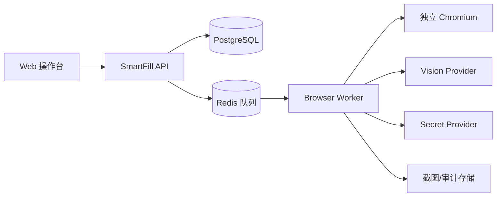

# SmartFill 第一版对接与操作文档

本文同时面向实施人员和业务操作员。当前仓库尚未包含可执行程序，本文件定义第一版需要实现的接口、配置和标准操作流程，后续实现必须与本文保持一致。

## 1. 第一版组成



建议第一版技术栈：

- Web：React + TypeScript + Vite。
- API：Python 3.12 + FastAPI + Pydantic。
- 队列：Celery/RQ + Redis。
- 数据库：PostgreSQL 16。
- 浏览器：Chromium + CDP；执行器适配 Stagehand 或 Playwright。
- 默认视觉 API：阿里云百炼 `qwen3-vl-flash`、`qwen3-vl-plus`。
- 文件与截图：开发环境本地目录，生产环境 MinIO/OSS。

## 2. 阿里云百炼接入

### 2.1 准备工作

1. 在阿里云百炼控制台开通模型服务。
2. 创建工作空间和 API Key。
3. 确认所在地域可使用 `qwen3-vl-flash` 和 `qwen3-vl-plus`。
4. 将密钥写入密钥服务或环境变量，不要写入数据库和代码仓库。

建议配置项：

```dotenv
VISION_PROVIDER=aliyun_bailian
VISION_FAST_MODEL=qwen3-vl-flash
VISION_STRONG_MODEL=qwen3-vl-plus
VISION_BASE_URL=https://dashscope.aliyuncs.com/compatible-mode/v1
DASHSCOPE_API_KEY=<由部署环境注入>
VISION_TIMEOUT_SECONDS=45
VISION_MAX_RETRIES=2
VISION_SEND_FULL_SCREEN=false
```

具体 Base URL 需按阿里云账号和地域配置。生产环境应使用模型快照或经过回归验证的模型版本，避免主线模型更新造成行为漂移。

### 2.2 统一 VisionProvider 接口

```python
class VisionProvider(Protocol):
    async def analyze(self, request: VisionRequest) -> VisionDecision: ...


class VisionRequest(BaseModel):
    task: str
    screenshot: str
    dom_summary: list[InteractiveElement]
    allowed_actions: list[str]
    canonical_fields: list[str]
    previous_action: Action | None


class VisionDecision(BaseModel):
    page_state: str
    interruptions: list[Interruption]
    field_mappings: list[FieldMapping]
    next_action: Action | None
    confidence: float
    need_human: bool
```

应用必须校验模型输出。校验失败时仅允许重试或进入人工队列，不能从自然语言中猜测动作。

### 2.3 模型提示词约束

模型输入包含：

- 当前业务目标。
- 脱敏截图或局部截图。
- DOM/无障碍树交互元素摘要。
- 允许动作列表。
- 统一字段列表和别名。
- 最近一次动作及其验证结果。

模型不得获得：

- 明文密码、完整身份证号、Cookie、Token。
- 未授权域名的页面信息。
- 本地文件系统和通用命令执行权限。

建议响应格式：

```json
{
  "pageState": "profile_form",
  "interruptions": [],
  "fieldMappings": [
    {
      "canonicalField": "person.idNumber",
      "elementId": "e-42",
      "bbox": [412, 336, 786, 382],
      "confidence": 0.96,
      "evidence": ["标签为证件号码", "证件类型为身份证"]
    }
  ],
  "nextAction": {
    "type": "fill",
    "elementId": "e-42",
    "valueRef": "person.idNumber"
  },
  "confidence": 0.96,
  "needHuman": false
}
```

### 2.4 默认路由

- DOM 唯一匹配：不调用模型。
- DOM 存在多个候选：调用 `qwen3-vl-flash`。
- Flash 低于配置阈值：升级到 `qwen3-vl-plus`。
- 敏感字段仍有歧义：人工确认；如接入第二模型，可先交叉复核。
- Canvas/纯图片页面：使用视觉坐标定位，但动作前后必须截图验证。

## 3. 浏览器执行器对接

### 3.1 浏览器环境

- 每个并行任务使用独立 Browser Context。
- 同一账号的登录和资料填写在同一 Context 内完成。
- 浏览器使用固定语言、时区、视口和缩放比例。
- 浏览器只允许访问任务域名白名单。
- 默认不复用业务人员日常 Chrome Profile。

### 3.2 页面快照

页面快照至少包含：

```json
{
  "url": "https://example.com/profile",
  "title": "个人资料",
  "viewport": {"width": 1440, "height": 900, "scale": 1},
  "elements": [
    {
      "id": "e-42",
      "role": "textbox",
      "accessibleName": "证件号码",
      "label": "证件号码",
      "placeholder": "请输入身份证号",
      "inputType": "text",
      "visible": true,
      "enabled": true,
      "bbox": [412, 336, 786, 382]
    }
  ]
}
```

元素 ID 只在当前页面快照中有效。页面变化后必须重新获取元素，禁止沿用旧坐标。

### 3.3 安全填值

模型返回 `valueRef` 后，执行器按以下顺序处理：

1. 校验当前 origin 在白名单内。
2. 校验 `elementId` 仍对应预期字段。
3. 从任务数据或 SecretProvider 读取真实值。
4. 填写目标元素并触发页面需要的 input/change/blur 行为。
5. 回读值并运行格式校验。
6. 记录脱敏结果。

## 4. 数据文件规范

第一版推荐模板列：

| 列名 | 必填 | 说明 |
|---|---:|---|
| record_id | 是 | 批次内唯一记录编号 |
| login_username | 是 | 登录用户名 |
| password_ref | 是 | 密钥引用，不建议直接放密码 |
| full_name | 否 | 姓名 |
| gender | 否 | `male`、`female`、`unknown` 或配置枚举 |
| id_type | 否 | 如 `CN_ID_CARD` |
| id_number | 否 | 身份证号；导入后加密存储 |
| phone | 否 | 手机号 |
| email | 否 | 邮箱 |
| address | 否 | 地址 |

导入阶段必须完成列映射、格式校验、重复检测和敏感字段确认。

## 5. 业务操作流程

### 5.1 创建任务

1. 登录 SmartFill 操作台。
2. 点击“新建填写任务”。
3. 选择已有网站模板，或输入经过管理员批准的目标网站。
4. 上传 CSV/XLSX，并确认列映射。
5. 选择“只填写不提交”或“提交前人工确认”。
6. 配置并发数、失败后是否继续和弹窗策略。

### 5.2 首次识别与试运行

1. 启动一个独立浏览器窗口。
2. SmartFill 识别登录页和字段。
3. 操作员确认用户名、密码和登录按钮映射。
4. 登录后识别资料页字段。
5. 操作员处理低置信度和敏感字段映射。
6. 选择一条数据进行试运行。
7. 系统填写但不提交，逐字段显示验证结果。
8. 操作员确认后保存模板并启动批次。

### 5.3 批量运行

- 操作台显示批次进度、当前记录、当前动作和浏览器实时画面。
- 操作员可暂停、继续、跳过当前记录或接管浏览器。
- 接管时自动化立即停止；操作员点击“交还控制”后重新扫描页面。
- 遇到验证码、MFA、跨域跳转或低置信度字段时进入异常队列。

### 5.4 异常处理

| 异常 | 操作员动作 |
|---|---|
| 验证码/MFA | 点击“接管”，完成验证后“交还控制” |
| 字段歧义 | 在候选字段中确认，或在页面中重新选择 |
| 登录失败 | 检查凭据，更新密钥引用后重试单条 |
| 业务校验错误 | 查看页面错误，修正数据或跳过记录 |
| 网站改版 | 重新运行字段识别，确认并生成新模板版本 |
| 不明弹窗 | 查看截图和风险说明，选择关闭、继续或终止 |

### 5.5 完成与导出

任务完成后检查：

- 成功、失败、跳过和待确认数量。
- 每条记录的最后状态、错误代码和处理建议。
- 是否存在未提交记录。
- 模型调用次数、人工接管次数和总耗时。

报告可导出 CSV/XLSX；审计截图只对授权角色开放。

## 6. 验收测试清单

- [ ] 标准登录表单无需视觉模型即可识别。
- [ ] 非标准标签可以通过局部截图正确映射。
- [ ] 密码不会出现在模型请求和日志中。
- [ ] 广告和 Cookie 弹窗关闭后重新扫描页面。
- [ ] 页面刷新后不会重复提交。
- [ ] 验证码触发人工接管。
- [ ] 意外跨域跳转立即停止。
- [ ] 中断后从字段级检查点恢复。
- [ ] 操作员可完整导出批次结果。

## 7. 常见问题

### 模型识别到了错误字段怎么办？

不要执行。将该映射标记为错误，人工选择正确字段，并保存为网站模板的新版本。该样本同时进入模型回归数据集。

### 页面弹窗关闭后为什么需要重新识别？

弹窗可能改变 DOM、焦点、滚动位置和元素坐标，继续使用旧快照会产生误点击风险。

### 是否可以直接保存明文密码在 Excel 中？

第一版可以提供受控导入迁移，但生产使用应立即转存到 SecretProvider，并从工作文件和普通日志中移除明文。

### 为什么默认不自动提交？

在字段映射和异常恢复尚未经过足够业务样本验证前，自动提交会放大误填风险。模板稳定后可由管理员按网站逐步开启。

