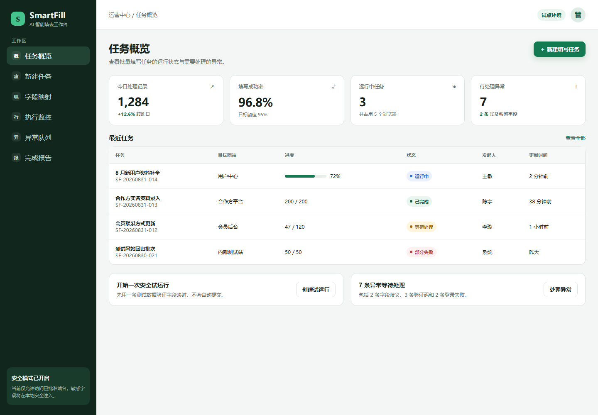
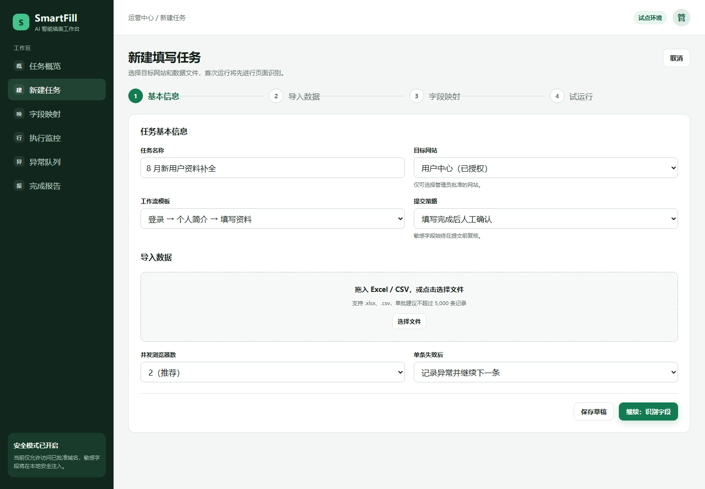
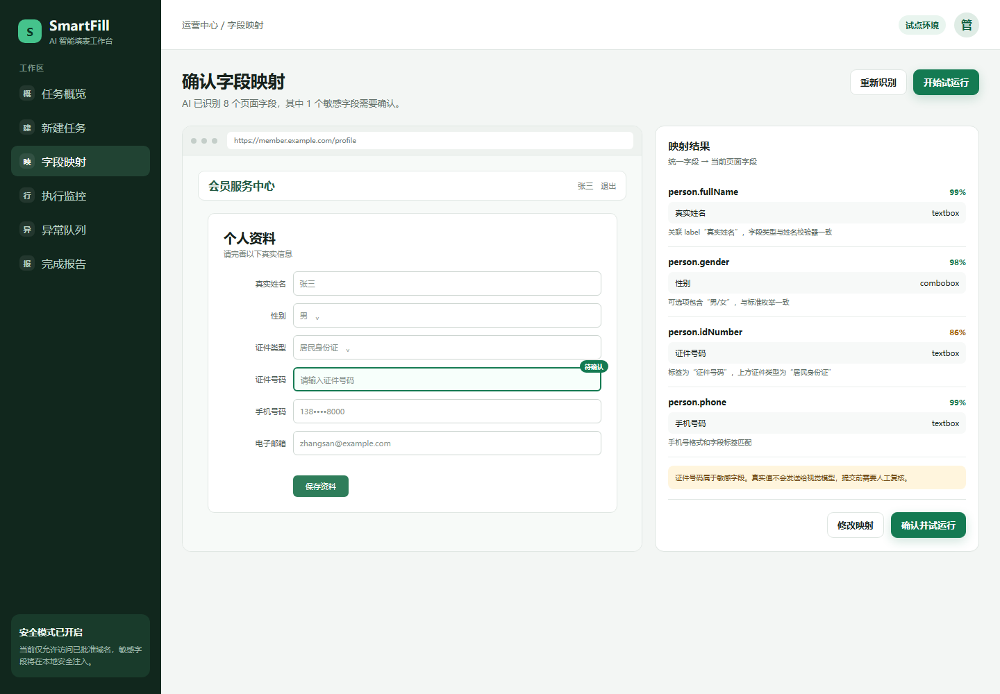
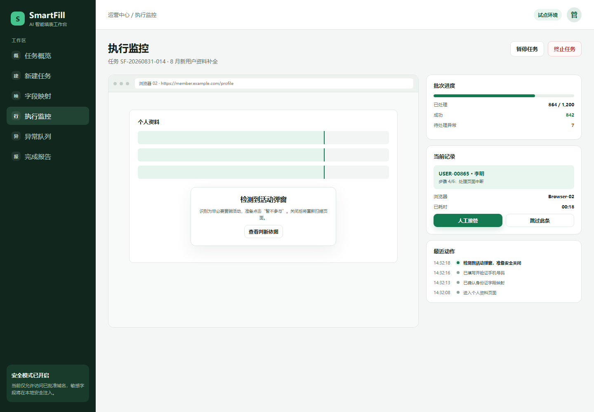
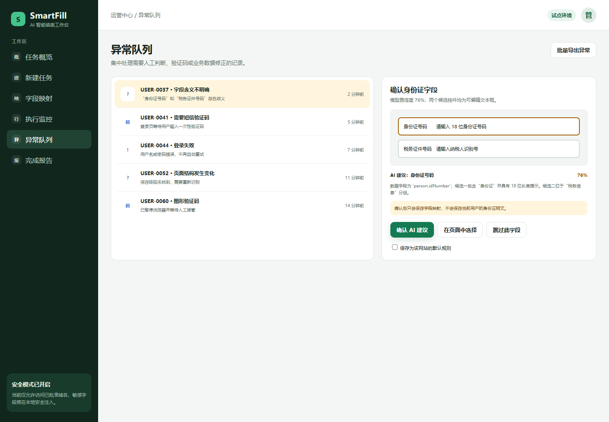
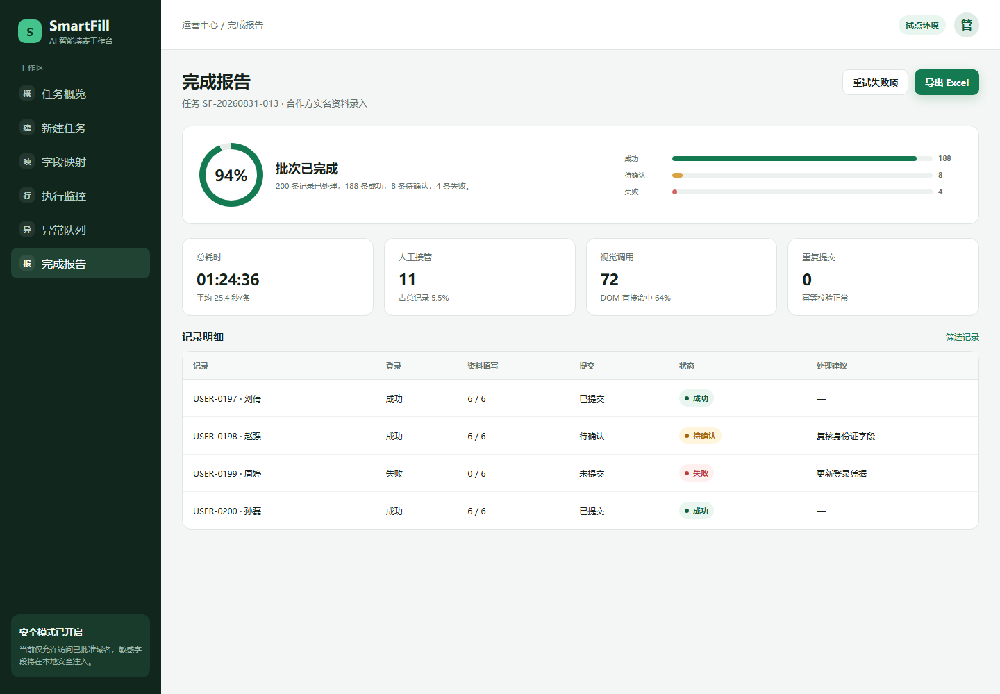

# SmartFill 产品原型说明

可交互原型入口：[`../prototype/index.html`](../prototype/index.html)

## 1. 原型页面

| 页面 | 目标 | 关键操作 |
|---|---|---|
| 任务概览 | 查看运行情况和最近任务 | 新建任务、进入任务详情 |
| 新建任务 | 选择网站、导入数据和提交策略 | 上传数据、下一步 |
| 字段映射 | 确认统一字段与页面控件的对应关系 | 接受建议、修改候选、试运行 |
| 执行监控 | 查看批量进度、浏览器画面和动作日志 | 暂停、接管、跳过、终止 |
| 异常队列 | 集中处理验证码、字段歧义和业务错误 | 确认、接管、跳过、保存规则 |
| 完成报告 | 查看成功率、错误分类和记录结果 | 导出报告、重试失败项 |

## 2. 关键交互原则

1. 用户首先看到业务状态，不暴露模型、Token 和坐标等技术细节。
2. 自动化做出判断时展示“判断依据”和置信度，方便复核。
3. 敏感字段默认脱敏；需要查看时要求额外权限和操作确认。
4. 主操作每个页面最多一个，危险操作使用二次确认。
5. 人工接管后自动化停止；交还控制后必须重新扫描页面。
6. 异常按“需要处理”集中呈现，不要求用户翻阅原始日志。

## 3. 建议评审路径

1. 从“任务概览”点击“新建填写任务”。
2. 在“新建任务”确认四步式任务创建是否符合业务习惯。
3. 在“字段映射”重点评审证据、置信度和敏感字段提示。
4. 在“执行监控”评审暂停、接管和当前动作的可见性。
5. 在“异常队列”评审操作员能否快速、低风险地做决定。
6. 在“完成报告”确认业务所需的导出字段和统计维度。

## 4. 原型图

### 任务概览

### 新建任务

### 字段映射

### 执行监控

### 异常队列

### 完成报告

