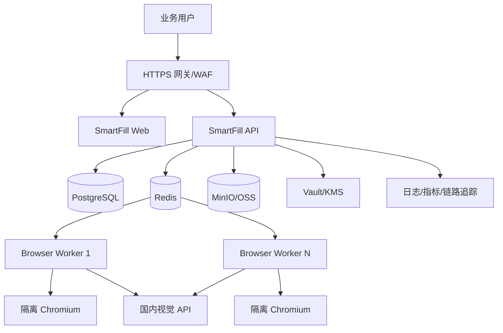

# SmartFill 部署方案

## 1. 部署目标

- 支持开发、试点和生产三种规模。
- 浏览器执行环境与业务主机隔离。
- 敏感数据不进入模型日志和通用日志。
- API、任务队列、Browser Worker、模型供应商可以独立扩缩容。
- 任务可以从检查点恢复，升级不会造成重复提交。

## 2. 推荐生产拓扑



## 3. 环境分级

### 3.1 开发环境

- 单机 Windows/Linux。
- Web、API、Worker 可同进程或 Docker Compose。
- PostgreSQL、Redis 使用本地容器。
- Chromium 使用独立用户目录并显示窗口，便于调试。
- 截图保存本地，使用测试数据和测试账号。

### 3.2 试点环境

- 一台应用服务器 + 一台或多台 Browser Worker。
- PostgreSQL、Redis 独立容器或托管实例。
- 只允许少量授权网站和账号。
- 默认单并发或低并发，所有提交人工确认。
- 开启完整操作轨迹和脱敏截图。

### 3.3 生产环境

- 容器平台或 Kubernetes。
- API 无状态多副本，Worker 按并发任务数量水平扩容。
- PostgreSQL 主备/托管高可用，Redis 开启持久化或使用托管队列。
- Browser Worker 运行于专用节点或沙箱虚拟机。
- 对外访问由域名白名单、网络策略和代理统一控制。
- 密钥托管在 Vault/KMS/云密钥服务。

## 4. 服务划分

| 服务 | 职责 | 是否持久化 |
|---|---|---:|
| web | 操作台、异常队列、报告 | 否 |
| api | 用户、模板、任务、策略、审计 API | 否 |
| scheduler | 批次拆分、重试、定时任务 | 否 |
| browser-worker | 页面识别、模型调用、浏览器执行 | 仅临时浏览器目录 |
| postgres | 业务数据、状态、映射模板、审计索引 | 是 |
| redis | 队列、锁、短期状态 | 是/可恢复 |
| object-storage | 脱敏截图、轨迹和报告文件 | 是 |
| secret-provider | 密码、API Key、加密密钥 | 是 |

## 5. 建议目录结构

```text
smartFill/
├─ apps/
│  ├─ web/
│  ├─ api/
│  └─ worker/
├─ packages/
│  ├─ browser-driver/
│  ├─ vision-provider/
│  ├─ profile-schema/
│  └─ interruption-handlers/
├─ deploy/
│  ├─ compose/
│  ├─ kubernetes/
│  └─ scripts/
├─ docs/
└─ prototype/
```

## 6. 配置与密钥

配置分为普通配置和密钥配置。

普通配置示例：

```dotenv
APP_ENV=production
PUBLIC_BASE_URL=https://smartfill.example.com
DATABASE_URL=postgresql+asyncpg://smartfill@postgres/smartfill
REDIS_URL=redis://redis:6379/0
OBJECT_STORAGE_ENDPOINT=https://oss.example.com
BROWSER_HEADLESS=true
BROWSER_VIEWPORT_WIDTH=1440
BROWSER_VIEWPORT_HEIGHT=900
BROWSER_MAX_CONCURRENCY=4
ALLOWED_ORIGINS=https://target.example.com
DEFAULT_SUBMIT_POLICY=human_confirm
```

密钥配置：

- `DASHSCOPE_API_KEY`
- 数据库密码
- 对象存储密钥
- 会话加密密钥
- 用户登录凭据

这些内容必须由部署平台注入，禁止提交到 Git。

## 7. Browser Worker 隔离

1. Worker 使用非 root/低权限用户运行。
2. 每个任务创建独立临时用户目录和 Browser Context。
3. 只挂载必要的下载目录，不挂载宿主机用户目录。
4. 禁止访问云元数据地址、内网管理网段和未授权公网域名。
5. 任务完成后删除临时浏览器数据；需要持久会话时使用加密 Profile 存储。
6. CPU、内存、执行时间和打开标签页数量都设置上限。

## 8. 数据库与幂等性

核心表建议：

- `users`、`roles`
- `sites`、`site_policies`
- `workflow_templates`、`template_versions`
- `batches`、`records`、`field_checkpoints`
- `browser_sessions`
- `model_calls`
- `interruptions`
- `action_audits`
- `artifacts`

提交动作使用 `record_id + workflow_step + page_fingerprint` 生成幂等键。执行前加分布式锁，执行后持久化页面成功证据。Worker 崩溃恢复时先检查幂等记录，不直接重复点击。

## 9. 容量规划

不要只按 API QPS 规划，浏览器内存通常是主要资源。建议通过压测获得：

- 单 Browser Context 峰值内存。
- 单条记录平均模型调用次数和截图大小。
- 目标网站平均响应时间和允许访问频率。
- 异常重试率与人工介入比例。

Worker 并发建议按公式控制：

```text
安全并发数 = min(
  可用内存 / 单浏览器峰值内存,
  模型 API 并发额度,
  目标网站允许频率,
  业务风险上限
)
```

首个生产批次应从低并发开始，按成功率、限流率和异常率逐步提升。

## 10. 可观测性

关键指标：

- 批次与记录成功率。
- 字段映射置信度分布。
- DOM 命中率、Flash/Plus 调用率。
- 单记录模型成本和执行耗时。
- 弹窗、验证码、登录失败和跨域跳转次数。
- 人工接管率、重复重试率和模板失效率。
- Browser Worker CPU、内存、崩溃和队列等待时间。

日志按 `trace_id / batch_id / record_id / browser_session_id` 关联。敏感字段在进入日志管道前完成脱敏。

## 11. CI/CD

建议流水线：

1. 静态检查、单元测试和安全扫描。
2. 使用本地测试页运行浏览器集成测试。
3. 使用脱敏截图集运行模型回归测试。
4. 构建带版本号和 commit SHA 的镜像。
5. 部署测试环境并运行端到端试运行。
6. 人工批准后灰度发布。
7. 先升级 API，再排空旧 Worker，最后升级 Worker。

模型切换不应随普通代码自动发布。模型版本、提示词、字段 Schema 和置信度阈值需要作为独立配置版本灰度。

## 12. 备份与恢复

- PostgreSQL 每日全量、持续增量备份，定期恢复演练。
- 模板版本、策略和审计记录纳入备份。
- 浏览器临时目录不备份。
- 截图按数据保留策略设置生命周期，过期自动删除。
- 模型提示词和 JSON Schema 跟随代码版本管理。
- 灾难恢复后，处于 `RUNNING` 的任务统一转为 `PAUSED`，经幂等检查后人工恢复。

## 13. 上线步骤

1. 部署测试环境和内部测试网站。
2. 接入百炼测试 Key，验证脱敏和日志。
3. 选择 3 个授权业务网站建立基准任务。
4. 只填写不提交，运行至少一个完整试点批次。
5. 修复字段映射、弹窗和恢复问题。
6. 开放人工确认提交。
7. 按网站逐个开启受控自动提交。
8. 达到稳定性门槛后扩容 Worker 和并发。

## 14. 回滚策略

- 应用回滚：保留上一版本镜像和数据库向后兼容窗口。
- 模型回滚：按供应商、模型名、提示词版本独立切换。
- 模板回滚：所有模板不可覆盖更新，只能新建版本；可切回上一稳定版本。
- 紧急停止：管理员可全局暂停队列、禁止提交动作并撤销目标域名授权。

