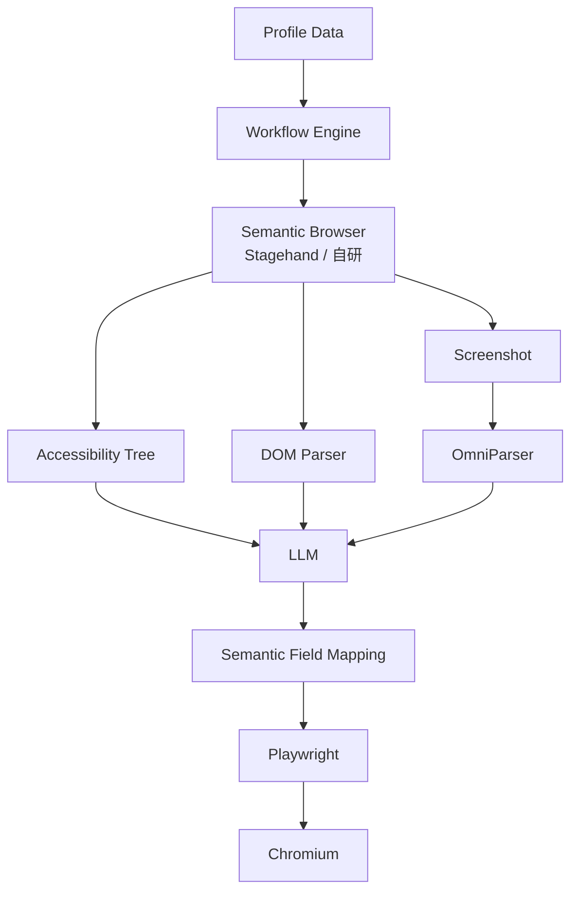

# SmartFill 系统架构与实现进度

> 状态基线：2026-08-31。本文区分“代码中已有模块”和“已经接入可运行主链路”；
> 只有后者才标记为已完成。

## 1. 目标架构



各层职责如下：

1. **Profile Data**：接收用户名、密码、姓名、性别、身份证号等标准人物资料。
2. **Workflow Engine**：管理任务状态、记录进度、异常、重试和人工接管。
3. **Semantic Browser**：获取页面观察结果，组织 DOM、无障碍树和截图信息。
4. **Accessibility Tree / DOM Parser / OmniParser**：从结构化页面和纯视觉页面提取可操作元素。
5. **LLM**：融合多种观察结果，理解页面状态、字段含义和异常类型。
6. **Semantic Field Mapping**：把 `person.fullName` 等统一字段映射到当前页面元素。
7. **Playwright / Chromium**：执行导航、填写、选择、回读验证和截图。

## 2. 当前实际运行链路

目前已经可运行的路径是 DOM-first 的第一版纵向链路：


这条链路已经能够：

- 从 Web 操作台创建任务并提交内置或任务级动态字段 Schema。
- 异步启动 Browser Job，通过 WebSocket 推送状态和事件。
- 启动隔离 Chromium，或通过 CDP 连接已有 Chromium。
- 按主文档和每个 iframe 采集完整 ARIA Accessibility Tree，并读取可见 `input`、
  `textarea`、`select` 的 label、ARIA、name、placeholder、input type 和 autocomplete。
- 穿透开放 Shadow DOM，并为 iframe/Shadow DOM 元素生成当前观察快照内的临时 id。
- 按中文/英文别名及 HTML 语义映射字段，不依赖固定坐标或站点专用 XPath。
- 关闭白名单内的安全弹窗，遇到验证码或 MFA 转为人工处理状态。
- 填写后逐字段回读验证；敏感字段截图前模糊处理；不点击最终提交按钮。
- 把任务进度、事件和最新脱敏截图反馈给 Web 操作台。
- 字段歧义、验证码或 MFA 时保留 Chromium 会话；操作员可以选择候选控件、完成外部
  验证后重新扫描，或终止任务并释放浏览器资源。

## 3. 分层实现进度

状态含义：✅ 已接入主链路；🟡 已有部分能力或独立模块；⬜ 尚未实现。

| 架构层 | 状态 | 当前实现 | 主要缺口 |
|---|---|---|---|
| Profile Data | ✅ v1 | Web 可动态增删字段；CSV/XLSX 可预览、按工作流字段映射并调度批量 Browser Job | 生产级外部 Vault、断点续跑和超大文件流式导入尚未实现 |
| Workflow Engine | ✅ v1 | 支持 1～10 个表单步骤在同一 Browser Context 顺序执行；任务、脱敏配置快照和事件时间线写入 MySQL | 尚无分布式队列、步骤条件分支、循环和批次重试 |
| Semantic Browser | ✅ v1 | 自研 `PlaywrightBrowserWorker` 已进入 API 默认执行链，并能在步骤间保留登录态 | Stagehand 未接入；站点模板和通用非表单动作尚未实现 |
| Accessibility Tree | ✅ v1 | 使用 Playwright ARIA Snapshot 按主文档和 frame 采集完整树，并关联可操作元素 | 后续可补 bbox、状态差异和跨浏览器归一化 |
| DOM Parser | ✅ v1 | 可提取主文档、iframe 和开放 Shadow DOM 中的可见表单控件 | Closed Shadow DOM、contenteditable、复杂组件和 Canvas 尚未覆盖 |
| Screenshot | 🟡 | 每个字段执行后截图，敏感字段模糊，并在 Web 展示 | 截图尚未进入识图/LLM 决策链 |
| OmniParser | ⬜ | 尚未接入 | 需要元素检测、边界框、OCR 和稳定 element id 输出 |
| LLM | 🟡 | 阿里云百炼 Qwen-VL `VisionProvider` 适配器和输出校验已有测试 | 尚未注入 `PlaywrightBrowserWorker`，当前运行不调用模型 |
| Semantic Field Mapping | ✅ v1 | 支持任务级动态字段 Schema、表单上下文、登录邮箱、确认密码关系、类型、autocomplete、派生字段和人工候选确认 | 尚无 LLM/视觉回退和模板持久化学习 |
| Playwright | ✅ v1 | 默认 AUTO 入口规划，可根据字段意图区分登录/注册入口，支持跳转后重扫描、多步骤填写、回读、路由拦截和可选提交策略 | 尚缺任意点击/等待/断言等通用动作和业务成功条件验证 |
| Chromium | ✅ v1 | 支持隔离启动和 `connect_over_cdp` | CDP 会话池、账号级 Profile 生命周期和并发资源管理尚未实现 |
| Web 操作台 | ✅ v1 | 工作流配置、页面扫描、动态字段、提交策略、实时状态、可折叠任务详情、白名单 URL 选择及用户批量导入均已接入 | 独立模板库和浏览器远程画面控制尚未实现 |

## 4. 当前执行到哪一步

按目标架构从上往下看，当前进度位于：

```text
Profile Data（单条和批量均接入主链）
  → Workflow Engine（MySQL 持久化、多步骤顺序执行可用）
  → Semantic Browser（自研 Playwright Worker 可用）
  → 官网入口点击 → 登录页重扫描 → 字段发现（v1 可用）
  → Accessibility Tree + DOM Parser（含 iframe/Open Shadow DOM）
  → Semantic Field Mapping（确定性 v1 可用）
  → 人工确认/重新扫描/恢复（v1 可用）
  → 提交策略/语义按钮识别/单次点击防重（v1 可用）
  → Playwright（真实执行可用）
  → Chromium（启动/CDP 可用）
```

因此，**DOM 语义明确的普通表单已经走通**。目标架构中的视觉分支仍停留在
“截图可采集、Qwen-VL Provider 可独立调用”，二者尚未连接；OmniParser 也尚未实现。
完整 Accessibility Tree、iframe、开放 Shadow DOM 和人工恢复已经进入主执行链。

当前最准确的里程碑定义是：

> 已完成第一版 structure-first 浏览器填写与人工恢复纵向链路；视觉模型保持为可选扩展。

## 5. 下一阶段建议顺序

1. **接入 VisionProvider 可选回退**：确定性 DOM 映射唯一时不调用模型；缺失或歧义时，
   把脱敏截图和候选元素发给 Qwen-VL，并严格校验返回的 element id。
2. **按需接入 OmniParser**：仅用于 Canvas、无语义控件或纯图片页面，并把边界框转换成
   页面快照内的临时 element id；坐标只允许在当前快照中使用。
3. **扩展页面组件覆盖**：补充 contenteditable、复杂自定义组件、Closed Shadow DOM
   兼容策略，以及 Accessibility Tree bbox/状态归一化。
4. **批量调度增强**：当前已串行调度并持久化批次进度；下一步补充 Redis/队列、幂等键、
   可配置并发、失败重试和服务重启后的断点续跑。

## 6. 代码对应关系

| 能力 | 主要位置 |
|---|---|
| Profile 导入和统一字段 | `src/smartfill/importing.py` |
| 批次调度与逐行执行 | `src/smartfill/batch_jobs.py` |
| 任务状态流转 | `src/smartfill/domain.py`、`src/smartfill/tasks.py` |
| Browser Job 调度和事件 | `src/smartfill/browser_jobs.py` |
| MySQL 仓储与系统配置 | `src/smartfill/persistence.py`、`src/smartfill/runtime_settings.py` |
| Alembic 数据库迁移 | `migrations/versions/20260901_0001_persistent_workflows.py`、`20260901_0002_batch_imports.py` |
| 动态字段 Schema、派生字段和默认字段 | `src/smartfill/field_schema.py` |
| DOM 抽取、字段映射和真实 Worker | `src/smartfill/browser_worker.py` |
| 浏览器插件边界和安全执行协议 | `src/smartfill/browser.py` |
| Qwen-VL Provider | `src/smartfill/vision.py` |
| API、WebSocket、截图和前端托管 | `src/smartfill/api.py` |
| Web 操作台 | `apps/web/src/App.tsx`、`apps/web/src/api.ts` |
| 真实 Chromium 验证 | `tests/test_playwright_worker.py` |

## 7. 完成判定

只有下列链路通过端到端测试后，才可把目标架构标记为完整：

- DOM 标准表单无需 LLM 即可完成字段映射。
- DOM 歧义表单可以通过 Qwen-VL 正确消歧。
- Canvas/纯图片页面可以通过 OmniParser 生成可验证目标。
- Accessibility Tree、DOM 和视觉结果能够指向同一个快照元素。
- 模型无法确认、验证码、MFA 和未知弹窗可以进入人工接管并恢复。
- CSV/XLSX 批次可以持久化、暂停、恢复、重试并导出结果。
- 密码、身份证号等明文不进入模型、公共 API、普通日志和未脱敏截图。

## 8. 当前验证基线

2026-09-01 对当前实现执行了以下检查：

| 检查 | 结果 |
|---|---|
| Python 全量测试（包含真实 Playwright/Chromium Worker） | 91 项通过 |
| Python 测试覆盖率 | 约 89%，高于 80% 门槛 |
| Web 组件/API 测试 | 22 项通过 |
| Mypy | 通过，无类型错误 |
| React/Vitest 测试 | 22 项通过，覆盖工作流、任务详情折叠、白名单 URL、批量导入、页面扫描、人工确认及 HTTP/WebSocket 协议 |
| 前端覆盖率 | Statements 84.27%、Functions 84.56%、Lines 86.66% |
| TypeScript + Vite 生产构建 | 通过 |
| Web → API → Worker → 人工确认 → 原会话恢复 E2E | 通过 |
| Web → API → iframe/Open Shadow DOM → 填写验证 E2E | 通过 |
| Worker → 仅填写/确认提交/自动提交真实 Chromium E2E | 通过 |
| API → 官网首页 → 登录入口 → 字段发现 → 登录页填写真实 Chromium E2E | 通过 |
| Worker → 登录提交 → 资料页填写的双步骤真实 Chromium E2E | 通过 |
| CSV → 已有双步骤工作流 → 2 个真实 Browser Job 批量执行 | 通过，2/2 完成 |
| MySQL 8 建库、Alembic 升级、任务/事件/系统配置写入与重读 | 通过 |

以上结果证明 DOM-first 纵向链路的模块和真实浏览器 Worker 可运行，但不等同于
视觉 LLM 或 OmniParser 已完成接入；批量执行 v1 已完成，但尚不包含生产级断点续跑。
